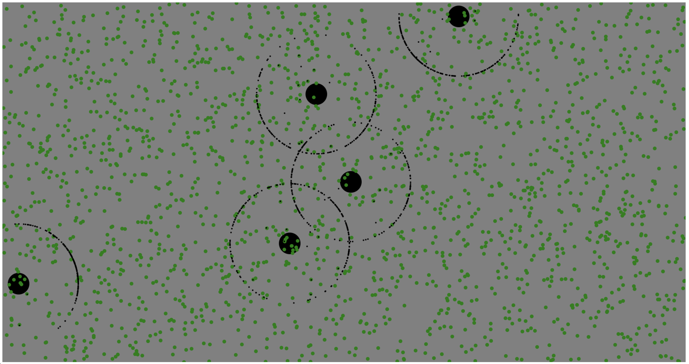

Ants and Leafs

const config = {
  height: 1000,
  width: 1900,
  homeAmount: 5,
  antsPerHome: 200,
  leafAmount: 2000
};

Start: npm run game
//localhost:3000

Materials:

https://tproger.ru/translations/finite-state-machines-theory-and-implementation/
https://radzion.com/blog/linear-algebra/vectors
https://habr.com/ru/post/255561/
https://gamedevelopment.tutsplus.com/series/understanding-steering-behaviors--gamedev-12732
https://frontender.info/building-multiplayer-games-with-node-js-and-socket-io/

